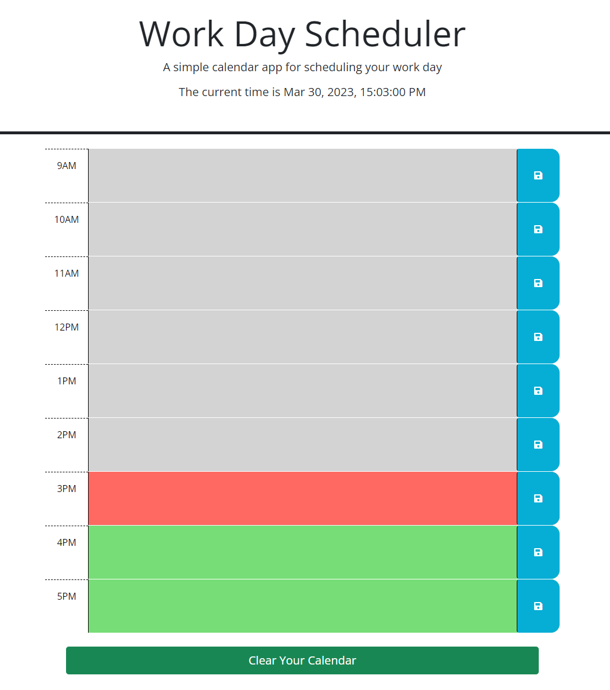

# work-day-scheduler

## Description
The [Work Day Scheduler](https://collylee.github.io/work-day-scheduler/) is a web app that lets you easily plan your work day in hourly increments. The page keeps constant track of the current time, and color-codes the hour blocks based on if they are in your past, present, or future.

The goal of this project was to further my skills with storing and retrieving local storage items in a more complex format than the previous challenge. I utilized JSON formatting to save and retrieve a full day's schedule in one array. It also was my first exercise in traversing the DOM using JQuery commands rather than vanilla JavaScript. The result is a page that accurately saves and retrieves your scheduled items in the correct format. 

## Usage

Once you've loaded the webpage, you'll notice that the current time loads in the header. This same time is what designates an hour block as past, present, or future. The time is formatted in a 24 hour day.

The color-coded blocks are text fields where you can type your hourly todos. Once you have added all of the necessary tasks to your schedule, hit the save button. That ensures that your work remains in the schedule when you close and reload the page.

If you want to clear your slate at the start of a new day, click the "Clear Your Calendar" button at the bottom of the page. This wipes the schedule clean.

## Credits
A major shout out to Ben Martin who helped me work out bugs with the color-coding and JSON formatting. Without his help during my tutoring session I probably wouldn't have been able to work out the last minute kinks in my JQuery each. functions.